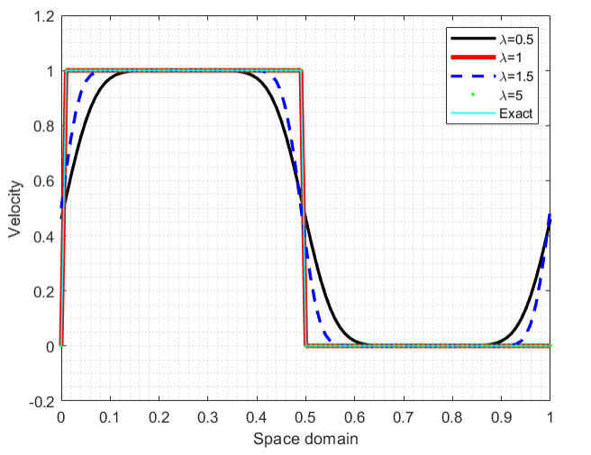
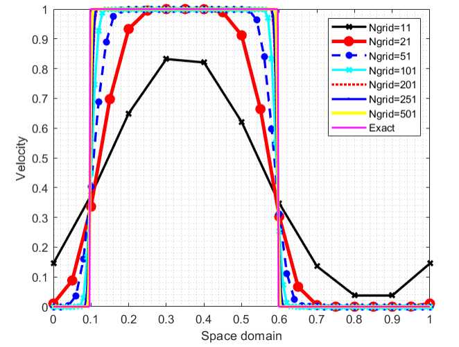
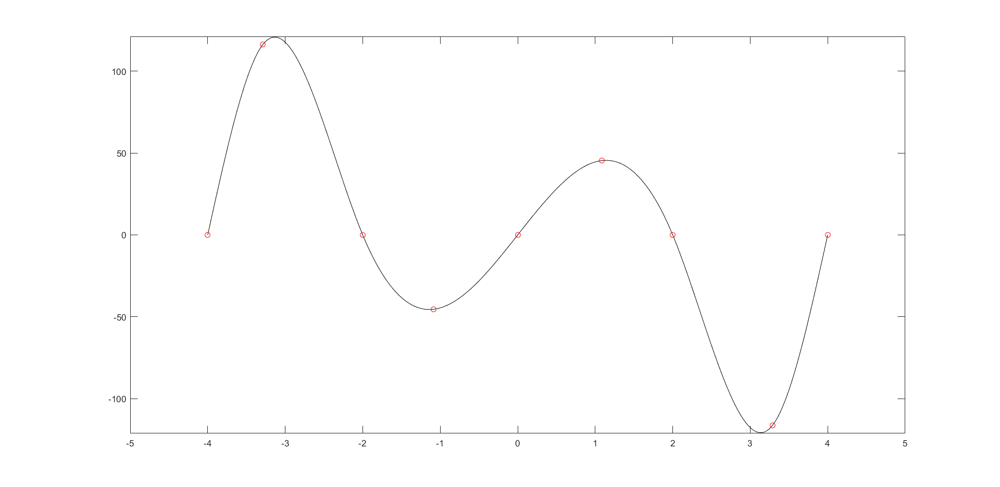
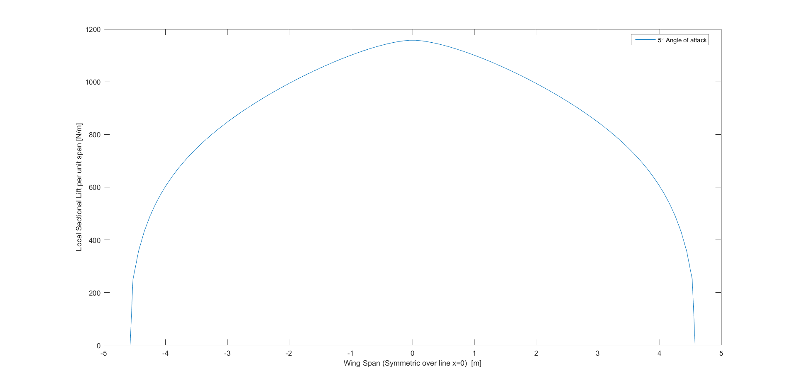

# CFD

CFD Tasks included currently in this repository:

(A)  For the advection equation, discretise and implement an upwind first order semi-Langrangian scheme and with a periodic boundary condition.

ADD ADVECTION EQUATION

DOMAIN

INITIAL CONDITIONS

LAMBDA VALUES FROM 0.5 TO 5.0

ALPHA 0.5

t=1s

(B) Add a new equation in the system by making propagation velocity non-constant and time-varying obeying the below:

SAME CONDITIONS AS ABOVE

SPECIFY THE VELOCITY EQUATION

DELTA-T = 0.1

SAME INITIAL CONDITIONS

VARYING GRIDPOINTS

(C) Cubic spline interpolation

(D) Non-Linear Lifting Line Method 3D Wing

Tested wing: PA-28-180 at:

Altitude: 

Velocity: 

AoA: 

